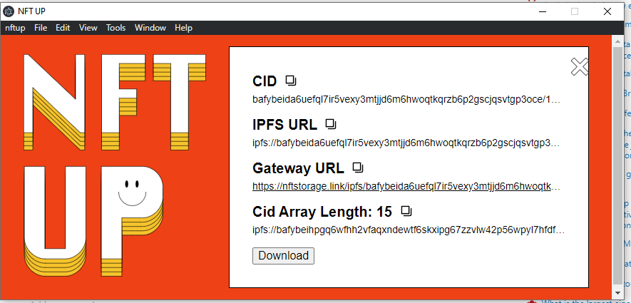

# NFT UP - Andrew's Version

<h1 align="center"></h1>

## Description

Andrew's version of the NFT UP app, used on https://nft.storage/.

Where you can drag and drop a folder, each file uploaded from a folder will have a different CID.

A CID in IPFS is this: **bafybeida6uefql7ir5vexy3mtjjd6m6hwoqtkqrzb6p2gscjqsvtgp3oce** <br />
The CID will be different for every file uploaded in Andrew's version

App to easily upload NFTs to NFT.Storage with no-code, from the comfort of your laptop computer machine.

Also the "Andrew's Version" name is a play of "Taylor's Version" from Taylor Swift's songs.

---

## Difference between Andrew's Version vs the original

The difference is that When you drag and drop a folder, in Andrew's version, every file uploaded from a folder will have a different CID.

### Example

If 5 different files were uploaded from a folder, their CID will be different, and the end result (with the file name) will be like this:

- ipfs://bafybeidsdelyaw2deuascc36qvom6chkjfwvzbuujanmtap5k27qfbd5ma/1.json
- ipfs://bafybeiahm42l6hfj33b37uzowd7knuob4lk3rub37koi2dx4l6ma4nuemi/2.json
- ipfs://bafybeiez46b22sxadd2odp7tqerh3yi6bqddivw5rx5i4ehsd3tm6g3hfe/3.json
- ipfs://bafybeig4fno2q3hqurkxftkkgox2frlglq235434ieqjyg3oaalfgnmb5y/4.json
- ipfs://bafybeicivnp2qzjmuqfas6hoblmppcnigdnqd5hqda4b4ybshrj35dtmrq/5.json

### Why is this useful

For an NFT project, (such as Fall Leaf Frens), I want the reveal to happen by the user, at their own terms. However, I also discovered a problem where most people can just upload a folder for the NFT art, and you can easily just change something like 1044.json to 564.json and discover all of the different rarities. I don't think that is right. Most users solve this via having a centralized server, or they just end up rugging the entire project and never revealing the art.

I wanted to solve this, to upload each NFT metadata and image as their own CID. Then it would be much more challenging to find the metadata and image using JSON.

### Story and motivation

I originally wanted to create this for Fall Leaf Frens. Honestly I had no idea where to truly start. I recently worked on a project called "Fleamint", and I saw them use NFT Storage and the NFT Up application. I found out the NFT Up application was open source, and I decided to modify it to fit my needs.

---

## Install

Andrew's version doesn't require this, but I am keeping this just in case
[Download and install the latest release](https://github.com/nftstorage/nftup/releases). (This is the one from the actual repo).

Run Andrew's version in VSCode.

To start running, `git clone` and then change directories into this folder, and then run `npm install` and install the dependencies.

Then afterwards, go into VS Code, and click on "Run and Debug" (or use the shortcut Ctrl + Shift + D) and press F5 or click on the "play button". Make sure "Electron: Main" is selected from the dropdown menu.

Afterwards, just drag and drop a folder containing only json files or images files . Make sure no other folder is in there (I haven't tested that, but my assumption is that the folder within a folder will be uploaded). To test this out, head to the "Example" folder and feel free to drag and drop the folder titled "Example JSON Folder to drag and drop". You will see each JSON file being uploaded onto IPFS with its own CID.

You will need the API key from [NFT Storage](https://nft.storage/).

## Features

- Drag and drop interface. Accepts files and directories:

    

- Upload progress, file and size indicators. Automatic retry on fail:

    

- Easy copy paste of content identifier (CID), IPFS URL or IPFS Gateway URL:

    

- Multi platform - runs on MacOS, Linux, Windows.
- When a folder is dragged and drop, every file uploaded will have a different CID.
- Click on the "Download Button" to download the CID / IPFS URI of each file that is uploaded. This will download a CSV file that will display the URIs similar in the example section above. The CSV will display every IPFS URI in order.
  - You _should_ wait until all of the files are uploaded before clicking on the "Download" button. That is why I added text called "Cid Array Length" to show you how many files were uploaded on IPFS.

## Getting Started (Developers)

Clone the repo and install dependencies:

```
npm install
```

Start the app like:

```
npm start
```

Andrew recommends to start the App using the VSCode debugger. Read in the section above on how to do that.

## Contributing

Feel free to join in. All welcome. [Open an issue](https://github.com/nftstorage/nftup/issues)!

## License

Dual-licensed under [MIT + Apache 2.0](https://github.com/nftstorage/nftup/blob/main/LICENSE.md)

## Image of what it Andrew's Version looks like once upload of folder is completed


